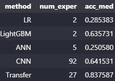
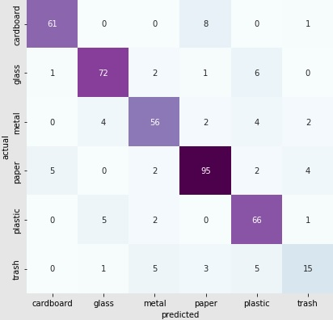
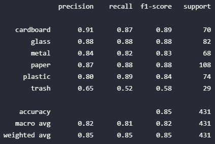

## Computer vision
*This project is a first experience with computer vision tasks, and after implementing several distinct image operations with Python, an **image classification model** was constructed. The dataset used to train and apply this model consists of thousands of pictures of garbage items, so the model has the job of predicting to which of the following classes the picture of an item belongs to: cardboard, glass, metal, paper, plastic, and trash. After multiple rounds of experimentation, a final model was built using **Keras API** for neural networks modeling, including the use of **transfer learning** based on the Xception pre-trained model. The expected model performance was evaluated on test data and amounts for an expected accuracy rate of 84.7%. The hypothetical use of this model implied in a web-application developed using **Streamlit**, and the complete data product that provides the consume of the solution was deployed using **Docker** and **Amazon EC2**.*

----------

This project was developed having the following goal: *approach a computer vision task by exploring data manipulation of images and by developing a machine learning application based on image classification*.

Therefore, these are the project **objectives**:
* To have a first contact with computer vision.
* To implement a model life-cycle and develop a data pipeline for unstructured data.
* To have another end-to-end experience with data science project management.
* To develop another complete data product powered by machine learning.

Additionally, these are the **assumptions** that guided the entire project development:
* Only standard technologies will be applied.
* Only statistical model performance was evaluated, so no operational or business objectives were raised.
* The discovery stage of a data science project was not implemented, so all possible solution and product discussions were absent.

### Data

The dataset used to develop this project is the [Garbage Classification Data](https://www.kaggle.com/datasets/asdasdasasdas/garbage-classification) from Kaggle, and it is made upon *2527 different images from 6 different classes*. Each image consists of a single garbage item placed on top of a completely white surface and captured in a top-down perspective.

All images have jpg format, three color channels (RGB), 384 pixels of length and 512 pixels of height. For standardization purposes, the author's dataset already defines the training, validation and test subsets. From the complete dataset: 1768 (70%) are used for training models, 328 (13%) for model validation, and 431 (17%) for testing and evaluating models. The following table summarizes the dataset composition:
| Class     | Frequency | Train | Validation | Test |
|-----------|-----------|-------|------------|------|
| Cardboard | 403 (16%) | 16%   | 14%        | 16%  |
| Glass     | 501 (20%) | 20%   | 20%        | 19%  |
| Metal     | 410 (16%) | 16%   | 17%        | 16%  |
| Paper     | 594 (24%) | 23%   | 25%        | 25%  |
| Plastic   | 482 (19%) | 20%   | 19%        | 17%  |
| Trash     | 137 (5%)  | 5%    | 5%         | 7%   |

The following images illustrate the dataset components:

Sample images

### Data product
*This project has not the intention of any concrete application, and its main and original objective is to help the author understand how to analytically and programmatically handle with image data*.

Notwithstanding, given that real world projects are always oriented to constitute a product or service that helps solving a relevant business or operational problem, the design of a product that allows a hypothetical user to interact with the analytical solution was also undertaken here.

Thus, we can consider the meaningful ***problem** of classifying garbage items among distinct categories*, which would help recycling activities.

Therefore, the *hypothetical **solution** consists of a mechanism that predicts the garbage class of an item given a picture of it*.

Consequently, the ***analytical solution** is an image classification model* able to predict to which garbage class the item in a picture belongs to.

If the solution to the garbage classification problem is powered by data and analytics (machine learning, specifically), it also requires some interface so the interested user can consume it. This imply in a digital [**product (or service)**](https://towardsdatascience.com/designing-data-products-b6b93edf3d23?gi=b938cad761a8) that provides the solution to its final user.

In real world, and given an industrial context, we could think of a system that works like this:
* Garbage items are placed in a track.
* Pictures are taken of each one of them individually.
* Each picture is sent to the image classification model (hosted in a server) through an API.
* The API sends back the predicted class of the associated item.
* Finally, the track sends each garbage item to the appropriate container depending on its predicted class.

However, given that the API interface for data products was already explored in another project ([End-to-end ML project](https://github.com/m-rosso/end_to_end_ml/wiki/End-to-end-ML)), the author chosen to develop a **web-application interface** for the data product that provides the (analytical) solution to the hypothetical end user. As a result, it was possible to explore some of the main tasks needed when developing a web-application, more specifically, the development using Streamlit for building the front-end of applications.

In short, the ***data product** developed in this project consists of a web-application that allows the user to upload a picture of an item and, then, to consume the image classification model to predict the garbage class that the item belongs to*. The section on deployment discusses in more detail how the application works.

### Technologies
Developing the project and implementing the solution involved different technologies, mostly based on *Python* libraries for constructing the classification model, *Streamlit and Docker* for wrapping the analytical solution, and *AWS* for deploying the final application. The table below summarizes all technologies used throughout the project:

| **Task**            | **Technology**                                                                                                                                                                                                                                                                |
|---------------------|-------------------------------------------------------------------------------------------------------------------------------------------------------------------------------------------------------------------------------------------------------------------------------|
| Data management     | [pandas](https://pandas.pydata.org/docs/)  [numpy](https://numpy.org/doc/)                                                                                                                                                                                                 |
| Image processing    | [Open CV](https://docs.opencv.org/4.x/)  [Pillow](https://pillow.readthedocs.io/en/stable/)                                                                                                                                                                                |
| Machine learning    | [Keras](https://keras.io/)  [Tensorflow](https://www.tensorflow.org/api_docs)  [scikit-learn](https://scikit-learn.org/)  [LightGBM](https://lightgbm.readthedocs.io/)                                                                                               |
| Deployment          | [Streamlit](https://docs.streamlit.io/)  [Docker](https://www.docker.com/)  [DockerHub](https://hub.docker.com/)  [Amazon EC2](https://aws.amazon.com/pt/ec2/)  [Amazon S3](https://aws.amazon.com/pt/s3/)  [Plotly](https://plotly.com/python-api-reference/) |
| Project development | [VS Code](https://code.visualstudio.com/)  [Google Colab](https://colab.research.google.com/)                                                                                                                                                                              |

### Methodology
This project has undertaken the traditional [CRISP-DM](https://pt.wikipedia.org/wiki/Cross_Industry_Standard_Process_for_Data_Mining) methodology for the development of the analytical solution constructed here. As declared in the introduction of this document, it is an assumption to the project the absence of Discovery activities (operations understanding, problem definition, solution brainstorm etc.) and the focus on constructing an analytical solution based on an image classification model. Therefore, *only development activities were implemented (i.e., the Delivery phase)*. Such activities are summarized in the following table:

| Stage            | Activities                                                                                                           |
|------------------|----------------------------------------------------------------------------------------------------------------------|
| Data engineering | Reading images Data understanding and cleaning (resize operation).                                                  |
| Data preparation | Data scaling (normalization) Data augmentation (operations of flip, rotation, blur, shift, brightness change, crop) |
| Data modeling    | Architecture and hyper-parameters tuning Model evaluation Model selection Further model analysis          |
| Deployment       | Front-end development Dockerfile and Docker Image construction Application serving                             |
| Documentation    | Description of activities Backlog of future work Conclusions                                                   |

### Data engineering and preparation
One of the main purposes of this project was to get more experience analytically handling image data using a programming language, as Python. Consequently, the notebook "Data Engineering" (*notebooks* folder of project's Github) not only **reads all images and describes the dataset**, but also focuses on exploring different **operations applied over image data**.

The outcomes from data reading and understanding were presented in an early section about the [data](#data). An extensive list of image operations were implemented using Python libraries as [OpenCV 2](https://opencv.org/), [Matplotlib](https://matplotlib.org/) and [Numpy](https://numpy.org/). Here are some of the most interesting operations explored throughout the project:
* Presenting images with a single color channel, in gray scale and binary scale.
* Crop.
* Resize.
* Flip.
* Rotation.
* Translation or shift.
* Filters: blur (average filter), Gaussian filter, median blur.
* Change in brightness, contrast, and saturation.

Check the file "Data Engineering.ipynb" in *notebooks* folder of project's Github to see how these operations work and what are their expected outcomes when applied over an image.

The notebook "Data Preparation" takes all these operations and applies them in a systematic manner. For instance, the Python class *ImportCleanImages* (module *data_eng.py* in folder *src* of project's repository) has an initialization argument to **resize** all images after reading them. Besides, all codes for applying image operations were wrapped in different functions or classes so they can be used in a standardized way (module *data_augmentation.py* in folder *src* of project's repository).

These operations can be applied for **data augmentation**, as they modify images with known labels so these modified images can join and expand the training dataset. Two different possibilities of data augmentation were explored in the project: using [Keras API](https://www.tensorflow.org/api_docs/python/tf/keras/preprocessing/image/ImageDataGenerator) and using those functions and classes developed in the project (custom data augmentation). Both usages are exemplified in "Data Preparation.ipynb" file.

Finally, another data preparation activity assumed in the project is **image scaling** (Python class *ScaleImage* in *transformations.py* module), which divides all pixel values by a certain scale amount (such as 255).

### Constructed models
Four different types of **learning methods** were explored througout the project:
* Standard *Machine Learning*: logistic regression from scikit-learn and LightGBM.
* Artificial Neural Network (*ANN*) using Keras API.
* Convolutional Neural Network (*CNN*) using Keras API.
* *Transfer Learning* using Keras API.

Several experiments were conducted for each of these learning methods, and the following table brings the most important results for their best models:

Summary table

The first three columns refer to the main model configurations: learning method, whether the images passed during model training had three color channels (True) or were in gray scale (False), whether data augmentation was used to expand the training dataset. The remaining columns are the total elapsed time during model fitting and *performance metrics* evaluated on test data: accuracy, weighted precision, weighted recall, weighted F1 score and Matthews Correlation Coefficient (MCC). All of these data refers to individual models, the best for each learning method.

Since the table is sorted from the smallest to the highest test accuracy, the **top three models** are the following: Transfer Learning model with and without data augmentation, CNN model with color images.

**Experimentation** was conducted differently between standard machine learning and neural networks (ANNs, CNNs and Transfer Learning). Logistic regression and LightGBM was explored in single rounds of grid and random search, respectively, so each of their experiments had multiple underlying configurations being tested.

Neural networks required several rounds of unique procedures of training, validation and test, which follows from their high complexity when optimizing architecture and hyper-parameters. Grid or random search was not applied to neural networks, so optimization assumed a manual approach of *build-evaluate-iterate*. The following table brings the number of experiments and the median accuracy of each learning method:

Experiments assessment

*Note*: besides of the fact that each round of experimentation with logistic regression (LR) and LightGBM involves multiple different combinations of hyper-parameters, which explains why only 2 experiments were implemented for each method, it is also important to highligh that the high number of experiments with CNN and Transfer Learning derives from:
1. It is an assumption of this project understanding how CNN works and how performance can be improved by changing the model architecture.
2. Both CNN and Transfer Learning were experimented more than others also because they have shown a higher sensibility to changes in architecture or hyper-parameters. Therefore, their large number of experiments derives from the higher expected improvements in performance.

The table below presents what were explored during experimentation with each learning method:
| Method              | Architecture and hyper-parameters                                                                                                                                                                                                                                                                                                                                                               |
|---------------------|-------------------------------------------------------------------------------------------------------------------------------------------------------------------------------------------------------------------------------------------------------------------------------------------------------------------------------------------------------------------------------------------------|
| Logistic regression | Regularization parameter.                                                                                                                                                                                                                                                                                                                                                                       |
| LightGBM            | Bagging fraction, maximum depth of trees, learning rate, number of trees.                                                                                                                                                                                                                                                                                                                       |
| ANN                 | Hidden layers: number of layers, number of neurons. Regularization: dropout parameter, regularization parameter and type. Fitting: number of epochs, batch size, patience parameter of early stopping.                                                                                                                                                                                    |
| CNN                 | Convolutional layers: number of layers, number of filters, kernel size, padding type, stride size, convolutional dropout. Pooling layers: pool size, types of pool padding and stride. Fully-connected layers: number of layers, number of neurons, dropout parameter, regularization parameter and type. Fitting: number of epochs, batch size, patience parameter of early stopping. |
| Transfer Learning   | Base model: ResNet, VGG 16, VGG 19, Xception. Fully-connected layers: number of layers, number of neurons, dropout parameter, regularization parameter and type. Fitting: number of epochs, batch size, patience parameter of early stopping.                                                                                                                                             |

Through all experimentation process some **lessons** were learnt and can be summarized here:
* *Standard machine learning has limited expected performance when applied to image classification*, due to its inability to capture multi-dimensional patterns in visual data.
* *Both machine learning and Artificial Neural Networks (ANNs) may end up using gray scale images to model training*, instead of having access to three channel (color) information. This follows from their requirement of a huge amount of parameters, which can ultimately collapse memory usage.
* Thus, *the convolutional architecture is crucial to both deal with visual data structure and save up a large amount of parameters*, as a consequence of how convolutional operations are designed.
* It is particularly striking *the efficiency of Transfer Learning*, since just a little effort in building image classifiers on top of pre-trained models can lead to great results.

### Model evaluation

#### The best model
Since the Transfer Learning model with and without data augmentation have virtually the same performance, the best model was taken to be the **Transfer Learning model with no data augmentation** given its smaller running time. It is relied to future work a deeper experimentation with data augmentation, so an improved use can increase even further the model performance.

#### Model architecture and hyper-parameters
The best overall model, the **Transfer Learning** model, was trained on top of [Xception](https://keras.io/api/applications/xception/) using 1768 images, validated by the end of each epoch using 328 images and evaluated on a test set containing 431 images. All images were resized to (224, 224, 3) before they were passed to the model, both for training and prediction. The training process involved a *batch size* of 64 data points during 50 *epochs* and using early stopping with a *patience* parameter of 12 epochs with not increase in validation accuracy. The loss function was the *categorical cross-entropy* and the output layer has 6 nodes (one for each garbage class) and was based on a *softmax activation function*. The model was built on top of [Xception](https://keras.io/api/applications/xception/), pre-trained model from Keras, and *average pooling* was used prior to the feeding of its outputs to the dense layer that precedes the additional architecture that is given by:
* 2 [Dense](https://keras.io/api/layers/core_layers/dense/) hidden layers with 1024 and 512 neurons.
* [ReLU](https://keras.io/api/layers/activation_layers/relu/) activation function.
* [Zero initialization](https://keras.io/api/layers/initializers/) for biases and [Glorot uniform](https://keras.io/api/layers/initializers/) initialization for weights.
* No regularization and no dropout.

Transfer Learning model architecture

#### Expected performance
Given the model evaluation over the test data, the Transfer Learning model has the following **overall expected performance**:
| Metric    | Expected value |
|-----------|----------------|
| Accuracy  | 84.7%          |
| Precision | 84.6%          |
| Recall    | 84.7%          |

The **performance by class** can be depicted using the confusion matrix.

Confusion matrix

The confusion matrix shows that **the class the model identifies the best is *cardboard*** (16% of train and test data). All but one misclassified cardboard images were predicted to be of a single class (paper), and also all but one images wrongly predicted to be cardboard actually belong to a single class, paper again. **The model has shown the worst performance when dealing with the *trash class***, the smallest available (5% of train and 7% of test data). This class has a pattern inverse to that seen in cardboards. The model has ambiguous performance when it comes to plastic images: it does well identifying true plastic images, basically being wrong when it takes as glass what is actually plastic; but the model predicts as being plastic several images that actually belong to a variety of other true classes.

Focusing on possible **operational issues**, the last confusion matrix column is the most important one. It is reasonable to think that wrongly predicting as trash objects from the other, recyclable classes is particularly bad since it could mean sending to dumping grounds recyclable objects that would take several years to be decomposed. The following table presents some shares of images wrongly predicted as being trash. Consequently, it seems that the worst scenario is given by the model performance on metal and plastic objects.
| Class     | Predicted as trash/All images | Predicted as trash/Wrong predictions | [Years to decompose](https://www.conserve-energy-future.com/how-long-does-it-take-to-decompose.php) |
|-----------|-------------------------------|--------------------------------------|--------------------|
| Cardboard | 1.4%                          | 11.1%                                | 2 to 3 months      |
| Glass     | 0%                            | 0%                                   | +1 million years   |
| Metal     | 2.9%                          | 16.7%                                | 50 to 200 years    |
| Paper     | 3.7%                          | 30.8%                                | 2 to 6 weeks       |
| Plastic   | 1.4%                          | 12.5%                                | 20 to 500 years    |

The analysis of performance by class is also reflected by **performance metrics calculated for each individual true class**. As the confusion matrix has shown, the cardboard class has the best performance, since it combines high levels of both precision (correct predictions over cardboard predictions) and recall (correct predictions over true cardboard images). Glass and paper also have satisfactory metrics, with a particular balance between precision and recall. Plastic has the highest difference between precision and recall: its better recall can reflect the fact that its share in all images drops from 20% in training data to 17% in test data. Given the operational concern of minimizing the share of objects being wrongly classified as trash, the very low recall rate for this class is less of a problem than its relatively low precision rate.

Performance by true class

#### Understanding classification errors
Now, let's see some **misclassified images** to understand how reasonable are these errors. The first error is a cardboard image mistakenly classified as a paper. This cardboard is actually very similar to advertisement papers, for instance, given its colors and the amount of information printed.

Cardboard image classified as paper

Next, another misclassified cardboard image in which it is clear why the model was confused, giving large weight to both plastic and trash classes as a consequence of the tape glued to the center of the cardboard.

Cardboard image classified as trash

Another fuzzy prediction is found in this glass image to which the model was not able to give a confident prediction.

Glass image classified as plastic

The next two metal images have clear features typical to papers and plastic, respectively. The first image of a can of soda or beer is so smashed that the model has taken it to be a crumpled paper. The second image has a curvature similar to a plastic container of some liquid as a juice.

Metal image classified as paper

Metal image classified as plastic

Now, this image is specially interesting because even a human being can have a hard time guessing if the object is metal or plastic, even though its true label is actually paper.

Paper image classified as plastic

The last image illustrates the problem of defining what is trash, since an object of this class is most of the time constructed using paper, plastic, glass or metal, but to be trash a garbage item is expected to have any dirt or organic residuals in it. This makes the job of identifying trash images particularly challenging.

Trash image classified as plastic

### Deployment
The solution deployment is centered in three different components: **Streamlit, Docker and Amazon EC2**.
* *Streamlit*: used to construct the front-end interface through which the user can interact with the application.
* *Docker*: used to package codes and data needed to deploy the application.
* *Amazon EC2*: used to pull the application's Docker image and to run it in order to serve the application to the user.

This image summarizes how the image classification model developed is combined with an interface so the user can upload images and receive a predicted garbage class.

Deployment architecture

#### Application interface (model + Streamlit front-end)
The image classification model needs to be combined with an **interface** that allows it to be consumed by the user. The interface chosen here is a web-application type, and [Streamlit](https://docs.streamlit.io/) was used to develop it, since it is the most efficient alternative to build a front-end and it is easily integrated with the classification model, given that it is also a Python library. The Python script that runs the web-application is straightforward: it imports necessary libraries and functions, loads data and configuration files, loads the classification model, and then constructs all widgets that make the graphical interface.

#### Code packaging (Docker)
All codes, data and configuration files needed to run the application were packaged into a Docker image, so wherever this image is pulled in a machine and executed it implies in a seamlessly application deployment.

First, a Dockerfile is created as follows:

<code class="docker">

    FROM python:3.7-slim

    WORKDIR /computer_vision/
    COPY . /computer_vision/

    RUN apt-get update && apt-get install ffmpeg libglib2.0-0 libsm6 libxrender1 libxext6 -y

    RUN pip install -r requirements.txt

    WORKDIR /computer_vision/app

    EXPOSE 8000

    CMD ["streamlit", "run", "01_Garbage_classifier.py", "--server.port", "8000"]

</code>

Then, a Docker image is created upon it, and after Dockerhub login is done, the image can be pushed into a Dockerhub repository.

<code class="command">

    docker build -t mrossods/comp_vision:v2 .

    docker login
    docker push mrossods/comp_vision:v2

</code>

This makes the application package available for deployment in any machine that has Docker installed.

#### Model serving (EC2)
Even though there are several different and more efficient alternatives for serving the application to the user, for simplicity purposes the deployment is server-based and makes use of an Amazon EC2 instance to host the web-application.

The main steps of server configuration is illustrated in the following images:

AWS Management Console

Network settings

The security group should allow HTTP (or HTTPS) inbound traffic to the EC2 instance, at the same time it blocks access to other ports, such as port 22, which allows SSH access and control of the instance. Additionally, the port 8000 was allowed for inbound traffic ("custom TCP"), since it was the port used to deploy the application:

Port 8000 allowed for inbound traffic

After the EC2 instance has been created and launched, its configuration make use of the following commands:

<code class="command">

    sudo apt-get update

    sudo apt install docker.io
    sudo service docker start
    sudo chmod 666 /var/run/docker.sock
    docker run hello-world

</code>

Just a few commands are need in order to get the Docker image of the web-application:

<code class="command">

    docker login
    docker pull mrossods/comp_vision:v2
    docker images

</code>

Docker images

Then, to run the web-application the following commands should be executed so a Docker container is launched:

<code class="command">

    docker run --name comp_container -p 8000:8000 mrossods/comp_vision:v2

</code>

Docker container launched

Finally, to consume the web-application the user should just access its URL, given by the EC2 instance public IP plus the port where the application was hosted:

Access to the web-application

After uploading an image, the user interaction with the web-application implies in the following outcomes:

Application outcomes

### Future work
Some tasks were left as future work, since they were not prioritized in this project. They can be gathered in three different categories: model development, application and deployment tasks.
* *Model development*: implement additional rounds of experimentation with the best transfer learning model, improve data modeling with data augmentation, develop averaging or bootstrap in order to statistically assess model performance, construct further data visualization during model analysis stage.
* *Application*: improve the front-end (design and functionalities), develop codes for model monitoring, develop codes for app and infrastructure monitoring.
* *Deployment*: test application deployment using Amazon Elastic Beanstalk, develop serverless application deployment.

### References
1. Neural networks.
	* [The Elements of Statistical Learning](https://hastie.su.domains/Papers/ESLII.pdf)
	* [Neural Networks and Deep Learning](http://neuralnetworksanddeeplearning.com/)
	* 
2. CNN.
	* [Convolution Neural Network – Better Understanding](https://www.analyticsvidhya.com/blog/2021/07/convolution-neural-network-better-understanding/)
	* [Introduction to Convolutional Neural Networks (CNN) with TensorFlow](https://towardsdatascience.com/introduction-to-convolutional-neural-networks-cnn-with-tensorflow-57e2f4837e18)
	* [Building a Convolutional Neural Network (CNN) in Keras](https://towardsdatascience.com/building-a-convolutional-neural-network-cnn-in-keras-329fbbadc5f5)
	* [Building a Convolutional Neural Network Using TensorFlow – Keras](https://www.analyticsvidhya.com/blog/2021/06/building-a-convolutional-neural-network-using-tensorflow-keras/)
3. Image classifier.
	* [TensorFlow for Computer Vision - How to Train Image Classifier with Artificial Neural Networks](https://towardsdatascience.com/tensorflow-for-computer-vision-how-to-train-image-classifier-with-artificial-neural-networks-304bc82f3dd)
	* [TensorFlow for Computer Vision - How to Train Image Classifier with Convolutional Neural Networks](https://towardsdatascience.com/tensorflow-for-computer-vision-how-to-train-image-classifier-with-convolutional-neural-networks-77f2fd6ed152)
	* [Develop your First Image Processing Project with Convolutional Neural Network!](https://www.analyticsvidhya.com/blog/2021/06/develop-your-first-image-classification-project-with-convolutional-neural-network/)
	* [Image Processing using CNN: A beginners guide](https://www.analyticsvidhya.com/blog/2021/06/image-processing-using-cnn-a-beginners-guide/)
	* [TensorFlow for Computer Vision - Does a More Complex Architecture Guarantee a Better Model?](https://towardsdatascience.com/tensorflow-for-computer-vision-does-a-more-complex-architecture-guarantee-a-better-model-2bce4ba15928)
	* [TensorFlow for Computer Vision - How to Implement Convolutions From Scratch in Python](https://towardsdatascience.com/tensorflow-for-computer-vision-how-to-implement-convolutions-from-scratch-in-python-609158c24f82)
	* [TensorFlow for Computer Vision - How to Implement Pooling From Scratch in Python](https://towardsdatascience.com/tensorflow-for-computer-vision-how-to-implement-pooling-from-scratch-in-python-379cd7717de9)
4. Transfer learning.
	* [Deep Learning and Transfer Learning](https://towardsdatascience.com/deep-learning-and-transfer-learning-31c6394b10c5)
	* [Transfer Learning: The Highest Leverage Deep Learning Skill You Can Learn](https://towardsdatascience.com/transfer-learning-in-deep-learning-641089950f5d)
	* [Transfer Learning for Image Classification using Tensorflow](https://towardsdatascience.com/transfer-learning-for-image-classification-using-tensorflow-71c359b56673)
	* [TensorFlow for Computer Vision - Transfer Learning Made Easy](https://towardsdatascience.com/tensorflow-for-computer-vision-transfer-learning-made-easy-e3d1418b110f)
	* [Transfer Learning in Keras with Computer Vision Models](https://machinelearningmastery.com/how-to-use-transfer-learning-when-developing-convolutional-neural-network-models/)
	* [Pretrained Models for Transfer Learning in Keras for Computer Vision](https://dev.to/amananandrai/pretrained-models-for-transfer-learning-in-keras-for-computer-vision-5eei)
